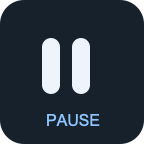
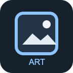
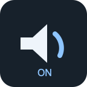
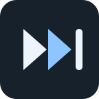
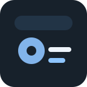
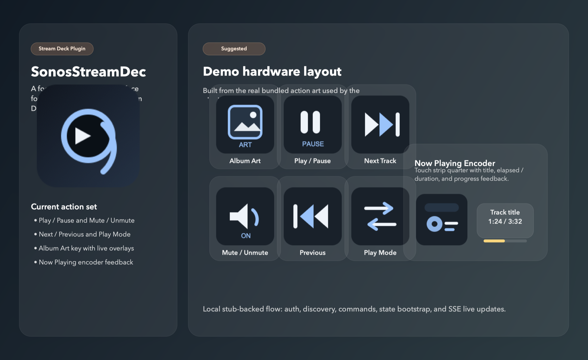
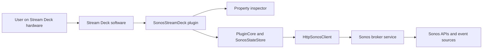
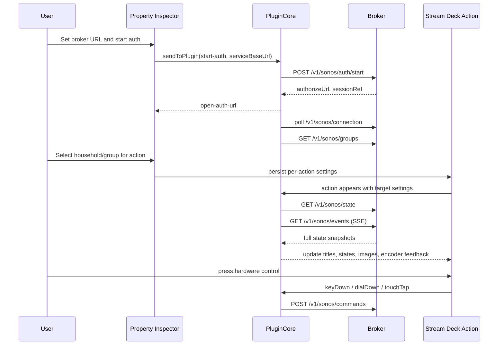
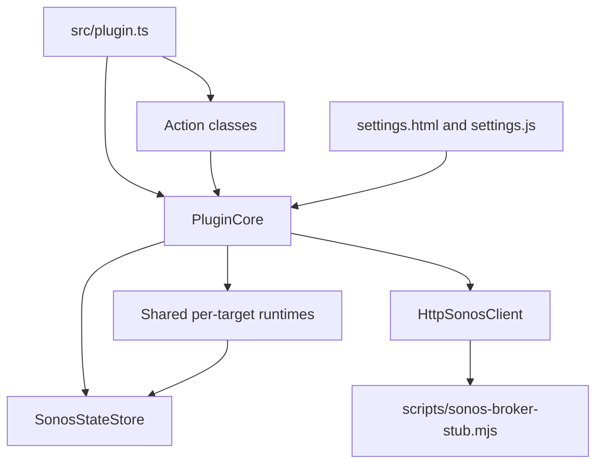

# SonosStreamDeck

`SonosStreamDeck` is a Stream Deck plugin for controlling Sonos playback and showing live now-playing information on Stream Deck hardware.

The product is the plugin itself.

- Users install it into the Stream Deck application.
- Users drag actions onto Stream Deck keys or Stream Deck Plus encoder slots.
- Users configure each action through the Stream Deck property inspector.
- The hardware surface becomes a focused Sonos control panel.

The current repository already supports local end-to-end testing against an internal Sonos broker stub, including auth kickoff, group discovery, command dispatch, state bootstrap, and live playback updates.

## Visual Preview

These are the current bundled plugin and action visuals. In the running plugin, titles, state, encoder feedback, progress, and album art can update live from Sonos state.

| Plugin | Play / Pause | Album Art |
| --- | --- | --- |
|  |  |  |

| Mute / Unmute | Next Track | Now Playing |
| --- | --- | --- |
|  |  |  |

The album-art key and now-playing encoder are more dynamic at runtime than these static assets suggest:

- album art can be replaced with broker-provided artwork or plugin-generated SVG fallback art
- the encoder surface can show current track, elapsed / duration, and progress indicator feedback

## Demo Layout Preview

This curated preview uses the real bundled action art to show a more intentional Stream Deck Plus-style layout for the plugin.



## Live Stream Deck Captures

These screenshots were captured from the local Stream Deck app while the plugin was linked for development.


## What The Plugin Supports

### Current Phase-1 Actions

- Play / Pause
- Mute / Unmute
- Next Track
- Previous Track
- Play Mode
- Album Art
- Now Playing encoder surface for Stream Deck Plus

### Current Behavior

- broker base URL configured in the property inspector
- Sonos auth started from the property inspector
- per-action Sonos group targeting
- broker-backed playback commands
- broker-backed state bootstrap with `fetchState(...)`
- live updates over SSE subscriptions
- shared target-aware state cache across visible actions
- local progress estimation between broker updates
- dynamic album-art rendering with SVG fallback visuals

## Planned And In-Progress Functionality

The current implementation is intentionally tested against a local broker stub first. The main items still planned after this milestone are:

- real production broker-backed Sonos auth and group discovery
- real fetched or proxied album art instead of stub data URIs
- capability-aware visuals such as dimming or altering controls when skip or pause is unavailable
- tighter property inspector UX for stale or missing Sonos targets

For the current status snapshot, see [docs/implementation-status.md](./docs/implementation-status.md).

## Architecture Overview

The project uses a thin Stream Deck plugin plus Sonos broker pattern.



Why this split exists:

- the plugin owns user interaction, rendering, and Stream Deck integration
- the broker owns Sonos-facing auth, discovery, normalized state, and event delivery
- the plugin stores only non-secret connection metadata such as the broker URL and broker session reference

### Runtime Data Flow



### Internal Plugin Components



More detail lives in [docs/architecture.md](./docs/architecture.md) and [docs/sonos-service-contract.md](./docs/sonos-service-contract.md).

## Repository Layout

- `src/plugin.ts` - plugin entry point and action registration
- `src/actions/` - Stream Deck action classes
- `src/core/` - shared plugin runtime, settings parsing, and state store
- `src/sonos/client.ts` - typed Sonos broker client
- `com.sonosstreamdeck.plugin.sdPlugin/` - Stream Deck plugin bundle, manifest, assets, and property inspector
- `scripts/sonos-broker-stub.mjs` - local broker stub for end-to-end testing
- `docs/` - project brain: architecture, status, ADRs, worklogs, troubleshooting

## Requirements

- Node.js 24 or higher
- Stream Deck software 7.1 or higher
- Stream Deck hardware, or Stream Deck Mobile for basic keypad testing
- Stream Deck Plus for encoder and touch-strip validation
- npm

These requirements align with the current Stream Deck SDK guidance and the plugin manifest.

## Build The Plugin

Install dependencies:

```bash
npm install
```

Build the plugin bundle:

```bash
npm run build
```

Validate the plugin bundle:

```bash
npm run validate
```

Useful development commands:

```bash
npm run watch
npm run broker:stub
npm run broker:stub:watch
```

## Install Into Stream Deck For Development

The easiest local development flow uses the Stream Deck CLI and developer mode.

### 1. Enable Stream Deck Developer Mode

```bash
npx streamdeck dev
```

Developer mode enables local plugin development and makes it easier to debug both the plugin runtime and the property inspector.

### 2. Link The Plugin Into Stream Deck

```bash
npx streamdeck link com.sonosstreamdeck.plugin.sdPlugin
```

This links the local plugin folder into the Stream Deck app so local builds are picked up directly.

### 3. Start The Local Broker Stub

In a separate terminal:

```bash
npm run broker:stub
```

The stub defaults to:

- host: `127.0.0.1`
- port: `47831`
- base URL: `http://127.0.0.1:47831`

### 4. Build Or Watch The Plugin

For one-off builds:

```bash
npm run build
```

For iterative development:

```bash
npm run watch
```

The watch script rebuilds the plugin and restarts `com.sonosstreamdeck.plugin` after each change.

### 5. Add Actions In The Stream Deck App

Inside the Stream Deck software:

1. Find the `SonosStreamDeck` category.
2. Drag one or more actions onto keys or an encoder slot.
3. Open the property inspector.
4. Enter `http://127.0.0.1:47831` as the service base URL.
5. Click `Connect Sonos`.
6. Complete the stub auth page opened in the browser.
7. Refresh groups if needed.
8. Choose a Sonos group for each action.

At that point you can press hardware buttons and see live state updates from the stub.

## Package The Plugin For Distribution Or Manual Install

Create a packaged `.streamDeckPlugin` file:

```bash
npx streamdeck pack com.sonosstreamdeck.plugin.sdPlugin -o dist
```

This produces a distributable plugin package under `dist/`.

For a release-style install workflow:

1. Build and validate the plugin.
2. Pack it with the command above.
3. Open the generated `.streamDeckPlugin` file on a machine with Stream Deck installed.

## Manual Test Checklist

Use these checklists for the first local hardware test.

### Basic Keypad Flow

1. Start `npm run broker:stub`.
2. Run `npm run build` or `npm run watch`.
3. Confirm the plugin appears in Stream Deck.
4. Add `Play / Pause`, `Next Track`, and `Album Art` actions.
5. Configure the broker URL and connect through the property inspector.
6. Assign a discovered Sonos group.
7. Press play / pause and verify the title and state change.
8. Press next / previous and verify metadata updates.
9. Verify album art and progress refresh over time.

### Stream Deck Plus Encoder Flow

1. Add the `Now Playing` encoder action to a Stream Deck Plus encoder slot.
2. Confirm the action shows the current track title after state sync.
3. Verify elapsed and duration feedback updates while playback is active.
4. Verify the encoder progress indicator advances over time.
5. Press or tap the encoder surface and confirm play / pause toggles correctly.

## Verification Model

Current runtime verification is still primarily local and manual:

- `npm run build`
- `npm run validate`
- manual Stream Deck testing against `npm run broker:stub`

GitHub Actions now also runs:

- `npm ci`
- `npm run build`
- `npm run validate`

There is not yet an automated unit or integration test suite in the repository.

## Supported Test Surface Today

Today, the repository is ready for:

- local build and validation
- local install into Stream Deck software
- hardware testing against the internal broker stub
- property inspector testing for connection and group assignment
- shared live-state testing across multiple visible actions targeting the same group

The repository is not yet ready for true production Sonos end-to-end testing without replacing the stubbed broker behavior.

## Troubleshooting Notes

If the plugin does not appear in Stream Deck after linking or building:

- restart the Stream Deck app
- rerun `npx streamdeck link com.sonosstreamdeck.plugin.sdPlugin`
- rerun `npm run validate`
- confirm Stream Deck developer mode is enabled

If auth or state updates do not work:

- confirm the broker stub is running
- confirm the property inspector base URL is `http://127.0.0.1:47831`
- confirm the action has a selected Sonos group
- inspect [docs/troubleshooting.md](./docs/troubleshooting.md)

## Documentation

The repo includes a lightweight project brain in `docs/`.

- [docs/00_HOME.md](./docs/00_HOME.md)
- [docs/architecture.md](./docs/architecture.md)
- [docs/implementation-status.md](./docs/implementation-status.md)
- [docs/sonos-service-contract.md](./docs/sonos-service-contract.md)
- [docs/troubleshooting.md](./docs/troubleshooting.md)

## Current Status Summary

- build verified locally
- Stream Deck validation verified locally
- stub-backed auth, discovery, commands, state, and SSE are wired end to end
- the next major milestone is replacing stub-backed broker behavior with the real Sonos production flow
