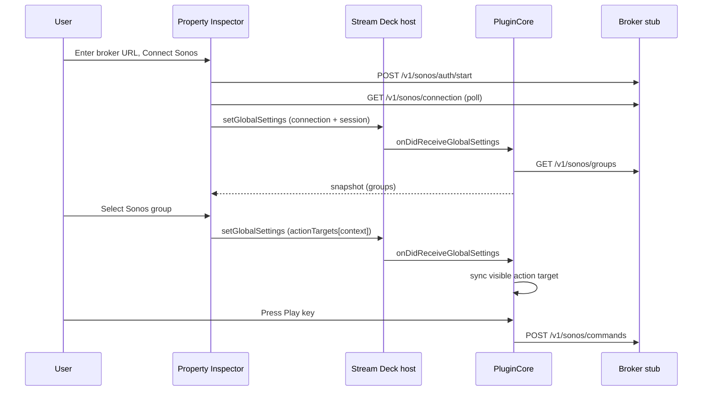
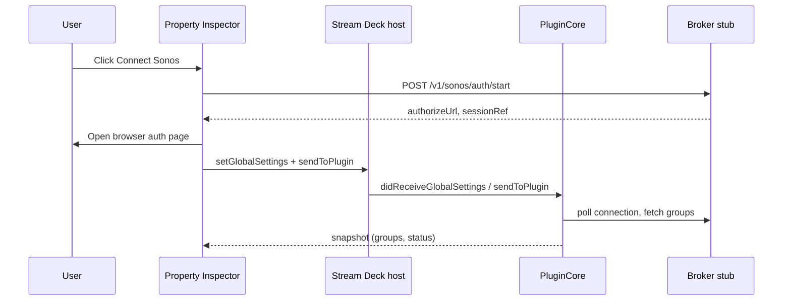

# Stream Deck Connect Investigation (2026-06-07)

Date: 2026-06-07  
Status: **resolved for stub E2E** — connect, group assignment, and commands work on hardware  
Decision: **document findings; remove temporary diagnostics; track follow-ups separately**

## Summary

Investigation into Stream Deck connect failures. The broker stub was always healthy; the break was in **which PI → Stream Deck → plugin paths actually deliver data** on Stream Deck 7.x with this plugin.

**Resolved (2026-06-07):** PI direct `fetch` + **`setGlobalSettings`** for connection and per-action targets (`actionTargets[context]`). Verified on hardware: connected → group selected → `Sonos command accepted: play-pause`.

**Still open:** PI `sendToPlugin` and PI `setSettings` do not reach the plugin in observed logs; SSE state subscription warns `service_unreachable` (commands work).

**For reviewers:** see [For Reviewers](#for-reviewers) for the diagnostic arc, hypotheses, and evidence table from the blocked period.

---

## Resolution (2026-06-07)

### Verified working flow



### Evidence log (user repro)

```text
Global settings received: connection=connected serviceBaseUrl=true session=true
Action target synced: play-pause context=18a819... target={"householdId":"house_1","groupId":"group_1",...}
Sonos command requested: play-pause connection=connected session=true target={"householdId":"house_1","groupId":"group_1",...}
Sonos command accepted: play-pause
```

First key press before group selection correctly failed: `invalid_target`.

### Root causes found

| Issue | Cause | Fix |
| --- | --- | --- |
| Connect appeared dead | Stale PI DevTools tab; `window.open` blocked; Connection UI below fold | PI layout reorder; remote debug via `:23654`; PI-owned auth/poll (no popup required for stub) |
| Global settings empty / wiped | `getGlobalSettings` race; experimental message IDs off | Re-enabled `useExperimentalMessageIdentifiers`; merge on plugin sync |
| Group stuck on "Saving…" | PI `setSettings` and `sendToPlugin` **never reach plugin** | Store targets in **`globalSettings.actionTargets[actionContext]`** via `setGlobalSettings` |
| Key press `target={}` after group | Same as above | Plugin `#syncVisibleActionTargetsFromGlobalSettings` + `runCommand` fallback |

### Paths that work vs do not (this install)

| Path | Works? | Used for |
| --- | --- | --- |
| PI `setGlobalSettings` | **Yes** | Connection metadata, `actionTargets` |
| PI `fetch` → localhost broker | **Yes** | Auth start, connection poll |
| Plugin `onDidReceiveGlobalSettings` | **Yes** | Apply connection + targets |
| PI `sendToPlugin` | **No** (not observed in plugin logs) | Was intended for sync-connection, set-target, refresh-groups |
| PI `setSettings` | **No** (no `Action settings updated` logs) | Abandoned for group pick |
| Plugin `sendToPropertyInspector` snapshot | **Yes** | Groups list in PI |

### Product code changes (keep)

- `GlobalSettings.actionTargets` — map of action context → `{ householdId, groupId, groupName }`
- PI `saveActionSettings` writes `actionTargets` via `setGlobalSettings` (optimistic UI confirm)
- Plugin `#syncVisibleActionTargetsFromGlobalSettings` on global settings apply
- PI connect: direct broker auth/poll; Connection section first in `settings.html`
- Broker scripts: `npm run broker:start|stop|status|test`

### Follow-ups (not blocking stub demo)

1. **SSE / live state** — `Sonos state subscription failed: service_unreachable` after commands; encoder/album art need SSE path debug on stub
2. **`sendToPlugin` mystery** — optional future: minimal repro or SDK version matrix; do not rely on this path until proven
3. **PI `setSettings`** — same; global `actionTargets` is the supported workaround for now
4. **Remove dead paths** — consider dropping PI `sync-connection` sendToPlugin spam once confident in global-settings-only flow

### Diagnostics removed (2026-06-07)

Temporary repro instrumentation (PI build markers, verbose PI console logs, broker per-request access log, PI appear debug lines) removed after resolution.

---

## Historical context (investigation arc)

The sections below document the **blocked period** before resolution. Keep for reviewers learning from the diagnostic process.

When reading the historical sections, treat phrases such as “today,” “current,” “not working,” and “next steps” as referring to the pre-resolution investigation state unless explicitly called out as a follow-up.

**Original summary (start of day):**

The Sonos broker stub is healthy and passes automated curl-based smoke tests. The Stream Deck plugin builds, validates, installs, and registers actions on hardware. The property inspector (PI) UI renders and can partially start broker auth from the browser, but **the plugin never reaches a reliable connected state** and **PI → plugin messaging does not show up in plugin logs during Connect attempts**.

This was a **Stream Deck integration / property-inspector wiring problem**, not a broker-stub problem.

---

## Environment Observed

| Item | Value |
| --- | --- |
| OS | macOS (darwin 24.6.0) |
| Stream Deck | 7.x (logs show plugin connected 2026-06-07 ~20:31 local) |
| Hardware | Stream Deck Plus (from prior handoff) |
| Node | 24+ (manifest requirement) |
| Plugin install | Symlinked dev install: `~/Library/Application Support/com.elgato.StreamDeck/Plugins/com.sonosstreamdeck.plugin.sdPlugin` → repo `com.sonosstreamdeck.plugin.sdPlugin` |
| Broker stub | `http://127.0.0.1:47831` via `npm run broker:start` |
| Broker status | `npm run broker:status` → running, `/health` OK |
| Broker tests | `npm run broker:test` → 9/9 PASS |

---

## What Works

### Broker stub (confirmed)

- `GET /health` returns OK
- `POST /v1/sonos/auth/start` returns `sessionRef` + `authorizeUrl`
- `GET /mock-sonos-login?sessionRef=...` marks session connected
- `GET /v1/sonos/connection`, `/v1/sonos/groups`, `/v1/sonos/state`, `/v1/sonos/commands`, SSE `/v1/sonos/events` all respond in curl tests
- CORS headers added for PI `fetch()` to localhost
- Management scripts: `npm run broker:start|stop|restart|status|test`

### Plugin scaffold (confirmed)

- `npm run build` succeeds
- `npm run validate` succeeds
- Plugin appears in Stream Deck action list
- Actions register on deck; plugin logs `Action visible: ...` when keys appear
- `streamdeck restart com.sonosstreamdeck.plugin` reloads plugin process

### Property inspector UI (partial)

- PI loads with broker URL field pre-filled or user-entered: `http://127.0.0.1:47831`
- **Connect Sonos** can trigger broker auth start from PI-side `fetch()` (user reported needing **Open Sonos sign-in page** link; auth URL appears)
- Browser stub login page can open and mark stub session connected (when visited)

---

## What Did Not Work During The Blocked Period

### End-to-end Stream Deck connect (primary failure)

User cannot get PI status pill from **Disconnected** → **Connected** reliably.

Observed PI state:

- Status pill: **Disconnected**
- Hero badge: **Waiting for broker connection**
- Copy: **The broker has not been connected yet**
- **Refresh Groups** stays disabled (expected until connected)
- **Action Target** stays **Idle**; no Sonos groups load

### Plugin never reflects PI connect progress (log evidence)

During Connect attempts, plugin log (`com.sonosstreamdeck.plugin.0.log`) shows **only**:

```
Action visible: play-pause context=... target={}
Action visible: album-art context=... target={}
...
```

It does **not** show (even after multiple fix attempts):

- `PI message received: ...`
- `Action PI message: ...`
- `sync-connection`
- `Starting Sonos authorization flow from PI action.`
- `Global settings received: connection=authorizing serviceBaseUrl=true ...`
- `Refreshing Sonos groups: ...`

Earlier session (before some fixes) did show:

```
Global settings received: connection=disconnected serviceBaseUrl=false session=false connectRequestedAt=none
```

That indicated global settings events reached the plugin but **without broker URL or session** — settings were empty or being wiped.

### Hardware / action runtime

- Actions show empty targets: `target={}` in logs
- Button presses previously failed with `not_connected` / `invalid_target` (from earlier log sessions)
- No verified successful command or live state update during this investigation window

---

## What The Logs Are Saying

### Plugin log (`~/Library/Application Support/.../logs/com.sonosstreamdeck.plugin.0.log`)

| Pattern | Meaning |
| --- | --- |
| `Action visible: ... target={}` | Stream Deck action appeared on deck; plugin registered it; **no Sonos group assigned** |
| `Global settings received: ... serviceBaseUrl=false` | Plugin got a global-settings event with **no broker URL persisted** (seen earlier; stopped appearing after `useExperimentalMessageIdentifiers` re-enabled) |
| `Sonos command failed: ... not_connected` | User pressed key while plugin connection state was disconnected (earlier session) |
| Absence of `PI message received` | **PI → plugin messages not reaching plugin handlers** during Connect, or Connect click not firing handler |

### Stream Deck app log (`~/Library/Logs/ElgatoStreamDeck/StreamDeck.log`)

| Pattern | Meaning |
| --- | --- |
| `[com.sonosstreamdeck.plugin] Plugin connected` | Plugin Node process connected to Stream Deck host |
| `Show PI for 'com.sonosstreamdeck.plugin.*'` | Property inspector opened for an action |
| `Open 'streamdeck://plugins/restart/...'` | Plugin restart triggered (dev workflow) |

Stream Deck logs confirm PI opens but do **not** expose PI WebSocket message payloads.

### Broker stub log (`.broker-stub.log` / terminal)

Not consistently captured during Stream Deck Connect attempts in this session. Curl tests hit the stub; **unclear whether Stream Deck PI auth requests reach stub when Connect is clicked** (needs explicit stub access logging during repro).

---

## Architecture Reminder

Intended connect flow:



**Actual behavior today:** PI may talk to broker directly, but **plugin does not observe or persist connected state** in logs. Hardware actions remain unconfigured.

---

## What We Tried (This Investigation)

### Property inspector fixes

| Change | Intent | Result |
| --- | --- | --- |
| Removed dead `#auth-complete-button` ref | Fix PI JS crash on render | PI renders; still not connected |
| PI `persistServiceBaseUrl` on connect | Save URL to Stream Deck global settings | Plugin still logged `serviceBaseUrl=false` (earlier) |
| PI direct broker auth via `fetch()` | Bypass plugin for auth start/poll | Auth link appears; user must click sign-in link; **Connected never sticks in PI** |
| PI `connectRequestedAt` global setting | Trigger plugin auth via settings change | No reliable plugin auth logs |
| PI `publishGlobalSettings` + polling loop | Push authorizing → connected state | PI UI stays Disconnected; plugin silent |
| PI `sync-connection` sendToPlugin message | Direct connection state to plugin | **No `PI message received` in plugin log** |
| CORS on broker stub | Allow PI fetch to localhost | Stub tests pass; Stream Deck connect still fails |
| URL input no longer wiped on render | Keep Connect button enabled | URL visible in UI; connect still fails |
| Broker management scripts + `broker:test` | Easier stub lifecycle / verification | Stub confirmed healthy |

### Plugin-core fixes

| Change | Intent | Result |
| --- | --- | --- |
| Skip `#synchronizeGlobalSettings` immediately after PI URL persist | Avoid wiping `serviceBaseUrl` | Partial; still unreliable |
| `mergeGlobalSettings` on sync | Keep in-memory URL if Stream Deck lag | Still saw empty settings earlier |
| Re-enabled `useExperimentalMessageIdentifiers = true` | Stop `getGlobalSettings` responses from firing `onDidReceiveGlobalSettings` and wiping state | Empty settings spam stopped; connect still fails |
| `SonosAction` base class with `onSendToPlugin` | SDK-recommended routing to plugin core | **No action PI messages in log** |
| Removed duplicate global `ui.onSendToPlugin` listener | Avoid double-handling | No improvement observed |
| `#handlePropertyInspectorAppear` no longer syncs settings on open | Avoid wiping state when PI opens | No improvement observed |
| Logging for global settings + PI messages | Diagnose path | Shows actions; **not** connect messages |

### Operational steps attempted (user + agent)

- `npm run build`, `npm run validate`
- `npx streamdeck link ...` (symlink already in place)
- `npx streamdeck restart com.sonosstreamdeck.plugin`
- `npm run broker:start|status|test`
- Instructions to quit/reopen Stream Deck
- `tail -f` on plugin log during Connect

---

## Historical Diagnostics / Future Regression Playbook

These items were assembled while connect was still blocked. After the 2026-06-07 resolution, use them only if the global-settings-based connect path regresses, or if someone intentionally reopens the `sendToPlugin` / `setSettings` mystery.

### PI Web Inspector (macOS — not right-click)

Stream Deck does **not** expose PI DevTools via right-click in the property inspector panel. Use remote debugging:

```bash
defaults write com.elgato.StreamDeck html_remote_debugging_enabled -bool YES
```

Quit Stream Deck fully, reopen, select a Sonos action so the PI is visible, then open **Chrome** to:

`http://localhost:23654/`

Pick the inspectable page for `com.sonosstreamdeck.plugin` (PI only appears in the list while the property inspector is open). Confirm `PI BUILD MARKER 2026-06-07-A` in the Console tab.

Or enable via CLI: `npx streamdeck dev com.sonosstreamdeck.plugin` (sets developer mode for the session).

### PI layout / scrolling

The action PI uses the same `settings.html` for every action. Stream Deck’s bottom panel is short; if **Connection** (broker URL + Connect Sonos) is off-screen, scroll **up** inside the PI. As of 2026-06-07 the Connection section is ordered **above** Action Target so Connect controls appear first.

### High-value next steps (when resuming)

1. **PI WebSocket introspection**
   - Use Stream Deck HTML remote debugging at `http://localhost:23654/`; right-click Inspect is not available in the macOS PI panel
   - Confirm `connect-click`, `publish-global-settings`, `send-to-plugin` logs
   - Capture red errors (CORS, fetch failures, `send-skipped`, socket not open)

2. **Broker access log during Stream Deck Connect**
   - Watch stub terminal while clicking Connect
   - Confirm whether PI `fetch` hits stub or only manual sign-in link does

3. **Verify `sendToPlugin` delivery at Stream Deck host level**
   - Add temporary PI-only test button that sends `{ type: "request-snapshot" }` and check for any plugin log line
   - If silent: action not in SDK action store when PI sends (context mismatch / `willAppear` timing)

4. **Minimal repro plugin**
   - Strip to one action + PI that only logs `sendToPlugin` round-trip
   - Isolates Stream Deck SDK wiring vs Sonos-specific logic

5. **Packaged install vs symlink**
   - `npx streamdeck pack ...` and install `.streamDeckPlugin` file
   - Rule out symlink / dev-link caching issues

6. **Stream Deck / SDK version matrix**
   - Confirm `@elgato/streamdeck` 2.x behavior on user's exact Stream Deck app version
   - Re-read SDK notes on PI `setGlobalSettings` vs plugin `didReceiveGlobalSettings`

7. **Official SDPI Components or sample plugin**
   - Compare against Elgato sample that uses `onSendToPlugin` successfully

8. **Automated test beyond curl**
   - No Node tests simulate Stream Deck WebSocket host
   - Would require mock Stream Deck connection or integration test harness

### Lower priority

- Production Sonos broker (out of scope for stub milestone)
- Group assignment persistence across PI context switches (secondary; verify after `actionTargets` path)
- Capability-aware button rendering
- Album art proxy

---

## For Reviewers

**Audience:** someone picking this up cold — another engineer, future self, or an external reviewer who has Stream Deck / Elgato SDK experience.

**Ask after resolution:** treat the global-settings-based path in [Resolution](#resolution-2026-06-07) as the known-good product path for the stub milestone. Only use the evidence table below if connect regresses or if reopening the unresolved `sendToPlugin` / `setSettings` delivery issue.

### Review feedback log (2026-06-07)

External review added the following guidance during the **blocked period**. Items were accepted for the evidence-first repro playbook; several were used, then diagnostics were removed after [Resolution](#resolution-2026-06-07).

| Review comment | Disposition | Where captured |
| --- | --- | --- |
| Prove bundle freshness before interpreting PI/plugin behavior | Accepted | [Bundle freshness checks](#bundle-freshness-checks) |
| Add a concrete instrumentation map (PI, stub, SDK, plugin) | Accepted | [Where to instrument temporarily](#where-to-instrument-temporarily) |
| Use a decision tree off the evidence table, not parallel guesses | Accepted | [Decision tree after the evidence table](#decision-tree-after-the-evidence-table) |
| Raw SDK `sendToPlugin` log before `actionStore` filter is the key R2 test | Accepted | instrumentation map + R2 |
| Broker access log on every Connect click is mandatory | Accepted | evidence table + re-entry checklist |
| Do not commit `node_modules` SDK patches | Accepted | noted in instrumentation map |
| SDK `console.log` may not appear in plugin log file | Accepted | instrumentation map — use SDK logger if needed |
| Remove diagnostics after evidence table identifies branch | Accepted | [Bundle freshness checks](#bundle-freshness-checks) |

**Pass 2 (same day):** instrumentation-before-rebuild ordering, SDK log caveat, cleanup step — reflected in [Recommended Re-Entry Checklist](#recommended-re-entry-checklist).

**Implementation (2026-06-07):** temporary diagnostics added for repro, then **removed after resolution**. Product path: global settings for connection + `actionTargets`; see [Resolution](#resolution-2026-06-07).

**Review consensus during the blocked period:** the next session should be **evidence collection only** — one Connect click, three tails (PI console, stub log, plugin log), then follow the decision tree to the first failed branch. After resolution, this remains the playbook for regressions rather than the default product direction.

### What to read first

1. [Summary](#summary), [Resolution](#resolution-2026-06-07), and [Bottom Line](#bottom-line-final)
2. [Review feedback log](#review-feedback-log-2026-06-07) — what review added and disposition
3. [Architecture Reminder](#architecture-reminder) sequence diagram
4. [What We Tried](#what-we-tried-this-investigation) — avoid repeating failed approaches
5. [Bundle freshness checks](#bundle-freshness-checks) — do this before Connect
6. [One-click evidence table](#one-click-evidence-table-fill-this-in-first) + [Decision tree](#decision-tree-after-the-evidence-table)

### Reviewer ideas (diagnostic-first)

Prove or disprove each with **one** Connect click while watching PI Web Inspector console, broker access log, and plugin log together.

#### R1: PI global-settings responses may overwrite newer local connected state

The PI currently calls `getGlobalSettings` on open, then later mutates local `state.globalSettings` during Connect and publishes `authorizing` / `connected`. If the earlier `didReceiveGlobalSettings` response arrives late with empty or stale persisted settings, the PI handler replaces local state unconditionally:

```js
case "didReceiveGlobalSettings":
  state.globalSettings = parseGlobalSettings(message.payload?.settings)
  render()
  break
```

This is similar to the stale-settings race already mitigated on the plugin side with experimental message IDs and merge logic. The PI raw WebSocket code does not currently use request IDs and does not merge incoming global settings.

Why it fits:

- Connect can start auth but the UI returns to **Disconnected**.
- The plugin previously saw global settings without `serviceBaseUrl`.
- PI state appears not to “stick” even when the broker stub is healthy.

How to prove/disprove:

- In PI console, log every `didReceiveGlobalSettings` with timestamp, payload, and current local `connectionStatus`.
- Click Connect once and look for a stale/empty `didReceiveGlobalSettings` after `publish-global-settings authorizing` or `publish-global-settings connected`.

Possible fix direction:

- Add message IDs to PI `getGlobalSettings` calls and ignore stale responses after local mutation.
- Or merge incoming global settings instead of replacing local state when local state is newer / more specific.

#### R2: `sendToPlugin` may be silently dropped by the SDK action store

The Elgato SDK routes PI messages through `actionStore.getActionById(ev.context)`. If the action context from the PI is not currently present in the SDK action store, the message is ignored before reaching `SonosAction.onSendToPlugin`.

Why it fits:

- PI may log `send-to-plugin`, but plugin logs show neither `Action PI message` nor `PI message received`.
- Existing plugin logs prove some actions appear, but not necessarily that the selected PI context is in `actionStore` at message time.
- Stream Deck Plus / page / profile / context switches can make action visibility and PI visibility diverge.

How to prove/disprove:

- Temporarily instrument the raw SDK connection for `sendToPlugin` before `actionStore` filtering.
- If raw `sendToPlugin` events appear but `Action PI message` does not, the context/action-store filter is the failure point.
- Log PI `actionInfo.context`, all `willAppear` contexts, and `propertyInspectorDidAppear` contexts in one repro.

Possible fix direction:

- Route PI messages through a global raw handler if safe, then validate payload/action manually.
- Or ensure PI only sends after the selected context has a visible action in the SDK action store.

#### R3: The broker stub auto-connects, so manual browser login should not be required

The current stub marks authorizing sessions connected after `readyAt` even without visiting `/mock-sonos-login`. Therefore, once PI `POST /v1/sonos/auth/start` succeeds and polling starts, `/v1/sonos/connection` should become `connected` automatically.

Why it matters:

- If the PI does not reach connected after a successful auth start, the failure is likely in PI polling, PI state overwrite, or Stream Deck settings/messaging—not Sonos login completion.

How to prove/disprove:

- Add or watch broker access logs for one Connect click.
- Expected minimum request sequence:

```text
POST /v1/sonos/auth/start
GET  /v1/sonos/connection?sessionRef=...
GET  /v1/sonos/groups?sessionRef=...   (after connected)
```

Interpretation:

- No POST: Connect handler/fetch is not running or is blocked in PI Chromium.
- POST but no connection GET: JS failed after auth start, possibly `window.open`, render, or thrown response parsing.
- POST + connected GET but UI disconnected: PI state overwrite or render/settings race.

#### R4: Stream Deck PI Chromium may fail localhost fetch differently than curl

Curl and `broker:test` only prove the broker is correct from the terminal. The PI runs inside Stream Deck’s Chromium environment and may hit different restrictions or runtime errors.

How to prove/disprove:

- Use PI Web Inspector Network tab and Console.
- Confirm `POST http://127.0.0.1:47831/v1/sonos/auth/start` exists, returns `200`, and has an `ok: true` JSON body.
- Capture any `TypeError: Failed to fetch`, CORS errors, local network restrictions, JSON parse errors, or popup/window errors.

#### R5: Global settings may persist but not notify the plugin reliably

The PI may be successfully calling `setGlobalSettings`, while the plugin does not reliably receive `onDidReceiveGlobalSettings` notifications in this setup.

How to prove/disprove:

- After a PI connect attempt, have the plugin explicitly call `streamDeck.settings.getGlobalSettings()` from a known plugin-side trigger and log the result.
- If explicit reads show the PI-written URL/session/status but no event was logged, persistence works and notification is the weak link.

Possible fix direction:

- Do not use global-settings change events as the only connect trigger.
- Explicitly synchronize settings on PI appear, key press, and short authorizing windows.

#### R6: Mixed PI-owned and plugin-owned auth paths make the failure ambiguous

Current debug code has multiple connect paths active at once:

- PI direct auth/poll
- PI `setGlobalSettings`
- PI `sendToPlugin` sync messages
- plugin-owned auth via `start-auth` / `connectRequestedAt`

This can hide the actual fault because one path can partially succeed while another path overwrites or ignores state.

Recommended diagnostic simplification:

- Test **PI-owned mode** temporarily: PI does auth, polling, groups fetch, and UI render directly; plugin only receives final settings/target selection.
- Test **plugin-owned mode** temporarily: PI only sends broker URL + one `start-auth` message; plugin owns auth, polling, groups, and snapshots.

Whichever mode fails identifies the broken boundary more clearly.

### One-click evidence table (fill this in first)

Capture during the next repro before changing more code:

| Timeline event | Expected? | Observed value |
| --- | --- | --- |
| PI console: `pi-connect` | yes | |
| PI console: `connect-click` | yes | |
| Broker: `POST /v1/sonos/auth/start` | yes | |
| PI console: auth response body | `ok: true`, `sessionRef` | |
| PI console: `publish-global-settings authorizing` | yes | |
| Broker: `GET /v1/sonos/connection` | yes | |
| PI console: connected connection response | yes after ~1s | |
| PI console: `publish-global-settings connected` | yes | |
| PI console: late `didReceiveGlobalSettings` empty/disconnected | should be no | |
| PI console: `send-to-plugin sync-connection` | yes | |
| Plugin log: raw `sendToPlugin` | yes if instrumented | |
| Plugin log: `Action PI message` | yes | |
| Plugin log: `PI message received` | yes | |
| Broker: `GET /v1/sonos/groups` | yes after connected | |

### Where to instrument temporarily

Use this as a short-lived diagnostic map. These edits are intended to produce one clean repro transcript, not to become permanent product code unless the resulting evidence justifies it.

| Layer | File / location | Temporary evidence to add |
| --- | --- | --- |
| PI lifecycle + socket | `com.sonosstreamdeck.plugin.sdPlugin/ui/settings.js` | Log `Date.now()`, `state.actionContext`, `state.uuid`, `state.socket.readyState`, full inbound message event, and parsed global settings before/after merge or replacement. |
| PI connect flow | `settings.js` `requestConnect()` and `waitForBrokerConnection()` | Log auth response body, every poll response body, exceptions including stack, and every `publishGlobalSettings()` payload. |
| Broker ingress | `scripts/sonos-broker-stub.mjs` near `createServer` handler | Log `${req.method} ${req.url}` for every request during repro. |
| SDK PI routing | `node_modules/@elgato/streamdeck/dist/plugin/ui.js` local-only | Log raw `sendToPlugin` event before `actionStore.getActionById(ev.context)` filters it. Do **not** commit this edit. |
| Plugin action contexts | `src/core/plugin-core.ts` + `src/actions/sonos-action.ts` | Log all `willAppear`, `propertyInspectorDidAppear`, raw/handled PI messages, and current known visible action context IDs. |
| Settings persistence | `src/core/plugin-core.ts` | Add a known plugin-side trigger that calls `streamDeck.settings.getGlobalSettings()` and logs the result after PI publishes settings. |

Suggested raw SDK diagnostic patch, local only:

```js
// node_modules/@elgato/streamdeck/dist/plugin/ui.js, inside onSendToPlugin(listener)
return connection.disposableOn("sendToPlugin", (ev) => {
  console.log(`[debug] raw sendToPlugin context=${ev.context} payload=${JSON.stringify(ev.payload)}`)
  const action = actionStore.getActionById(ev.context)
  console.log(`[debug] raw sendToPlugin actionFound=${Boolean(action)}`)
  if (action) {
    listener(new SendToPluginEvent(action, ev))
  }
})
```

Watch the plugin process log/stdout for this diagnostic. If `console.log` output does not appear in the plugin log on this Stream Deck install, switch this temporary diagnostic to the SDK logger or another known-visible plugin log path before drawing conclusions.

If this raw log appears with `actionFound=false`, the SDK is receiving PI messages but dropping them because the context is not in `actionStore`. If this raw log never appears while PI logs `send-to-plugin`, the message is being lost before the plugin SDK receives it.

### Decision tree after the evidence table

Use the first failed branch instead of continuing down the stack.

```text
PI does not log `pi-connect`
  -> PI bundle may be stale or Stream Deck is not loading settings.js.

PI logs `pi-connect` but not `connect-click`
  -> Button binding/render issue in PI.

PI logs `connect-click`, broker sees no POST
  -> PI Chromium fetch blocked/failed, wrong URL, or JS exception before fetch.

Broker sees POST but no connection polling
  -> JS exception after auth start; inspect auth JSON parsing, window.open, render, or state mutation.

Broker sees connected poll, PI never publishes connected
  -> PI poll/response parsing bug.

PI publishes connected, then receives empty/disconnected global settings
  -> R1 confirmed; fix PI stale global-settings overwrite first.

PI logs `send-to-plugin`, raw SDK log absent
  -> Stream Deck host / PI message delivery issue; try minimal repro or packaged install.

Raw SDK log present but `actionFound=false`
  -> R2 confirmed; PI context is not in SDK action store.

Plugin logs `PI message received`, but no groups load
  -> PI->plugin path works; debug plugin global settings, `HttpSonosClient`, and group fetch next.
```

### Bundle freshness checks

Because stale Stream Deck assets can mimic logic bugs, prove the running PI and plugin are current before interpreting subtle behavior.

- Add a temporary obvious console marker in `settings.js`, for example `console.info("PI BUILD MARKER 2026-06-07-A")`, rebuild/restart, and confirm it appears in PI Web Inspector.
- Confirm the built plugin bundle contains the expected diagnostics: `rg "PI message received|Action PI message|sync-connection" com.sonosstreamdeck.plugin.sdPlugin/bin/plugin.js`.
- If the marker does not update after rebuild/restart, quit Stream Deck fully and reopen. If still stale, test a packed `.streamDeckPlugin` install instead of the symlink.
- Remove temporary build markers, SDK patches, and extra diagnostic logs once the evidence table identifies the failed branch.

### Ranked debugging bets

1. PI stale `didReceiveGlobalSettings` overwrites newer connected state (R1).
2. SDK drops `sendToPlugin` because PI context is not in `actionStore` (R2).
3. PI fetch/poll fails inside Stream Deck Chromium despite curl success (R4).
4. Global settings persist but plugin does not receive change events reliably (R5).
5. Stream Deck serves a stale PI/plugin bundle despite rebuild/restart (H4).

### Questions for reviewers

| Question | If yes → | If no → |
| --- | --- | --- |
| Does PI console show `connect-click`? | Handler runs; look downstream | Connect button / render bug |
| Does stub log show `POST /auth/start` on Connect? | PI reaches broker | PI fetch blocked or handler not wired |
| Does stub auto-connect without browser login? | R3 confirmed; focus PI state / SD messaging | Stub behavior changed; re-read stub |
| Does PI show `send-to-plugin` but plugin silent? | R2 / SDK routing (strong signal) | Message never sent or wrong context |
| Does late empty `didReceiveGlobalSettings` follow `connected` publish? | R1 (strong signal) | Look at R2, R5, or H1 |
| Does `getGlobalSettings()` from plugin show PI-written URL? | R5 — persistence OK, events weak | Settings never persisted to host |

### Architectural review ideas

- **Simplify before extending:** R6 recommends testing PI-owned vs plugin-owned connect in isolation. Mixed paths may be hiding the fault.
- **Baseline comparison:** diff current `settings.js` / `plugin-core.ts` against [2026-04-26 handoff](../streamdeck-stub-handoff-2026-04-26.md) — did we regress a path that once worked in stub-only testing?
- **SDK contract check:** confirm PI `sendToPlugin` payload shape (`context`, `action`, `payload`) matches what `@elgato/streamdeck` 2.x expects for the action UUID in manifest.
- **Install mode:** symlink dev-link may cache PI assets differently than a packed `.streamDeckPlugin` — worth one controlled comparison before deep SDK debugging.
- **Scope guard:** album art, SSE, commands, and group UX are downstream; do not expand scope until connect evidence table has a full row.

### What would change our mind

| Observation | Conclusion |
| --- | --- |
| Plugin logs `PI message received` + `sync-connection` | H1 weakened; trace plugin-side auth/poll next |
| PI evidence table complete with all PI/broker rows green, plugin still silent | Host or SDK delivery bug; minimal repro plugin |
| Stale `didReceiveGlobalSettings` after connected publish | R1 confirmed; fix PI merge/ignore logic first |
| Stub never hit on Connect despite PI `connect-click` | R4 — Stream Deck Chromium / fetch environment |
| Packaged install works, symlink does not | H4 — dev install / caching |

---

## Leading Hypotheses (Unconfirmed)

Short summary of the same territory; see [For Reviewers](#for-reviewers) for diagnostic detail.

### H1: PI → plugin messages never arrive (most likely)

Evidence:

- Zero `PI message received` / `Action PI message` lines after Connect
- Plugin only logs action lifecycle events

Possible causes:

- PI WebSocket not open when sending (`send-skipped` in PI console — not yet captured)
- `sendToPlugin` uses wrong `context` / `action` fields
- Action not in SDK `actionStore` when PI message sent (listener drops message silently per SDK `ui.js`)
- Stream Deck host bug or version-specific PI regression

### H2: Global settings never persist broker URL to plugin (contributing)

Evidence:

- Earlier logs: `serviceBaseUrl=false` repeatedly
- `useExperimentalMessageIdentifiers` removal previously caused `getGlobalSettings` to overwrite PI writes

Current state:

- Re-enabled experimental IDs + merge logic
- Still no connected outcome; may be fixed partially but masked by H1

### H3: PI connect works locally in browser but UI state not updated (contributing)

Evidence:

- User must use **Open Sonos sign-in page** link
- Partial auth start (link populated) but status pill stays **Disconnected**
- Poll loop may fail silently or PI `state.globalSettings` not updating render

Needs PI console confirmation.

### H4: Dev symlink / stale bundle (possible)

Evidence:

- User saw old PI hint text at one point
- Multiple rebuild/restart cycles; user may not always quit Stream Deck fully

Mitigation not fully verified: full quit + reopen + restart plugin.

### H5: Duplicate / conflicting handlers (addressed, inconclusive)

We removed duplicate global `onSendToPlugin` and routed through `SonosAction` only. No improvement observed — suggests H1 dominates.

---

## What Is Probably Not The Problem

| Area | Why |
| --- | --- |
| Broker stub correctness | `npm run broker:test` passes all endpoints |
| Broker not running | `npm run broker:status` shows healthy process |
| Plugin build/validate | Both pass |
| Plugin not loaded | `Action visible` logs prove runtime active |
| Wrong broker URL in UI | User consistently uses `http://127.0.0.1:47831` |
| Need Sonos desktop app | Not required for stub path |
| Album art / SSE | Downstream of connect; **commands reached** in resolution; SSE still warns `service_unreachable` |

---

## Current Code State (Uncommitted Work)

Significant uncommitted changes exist on `main` from this investigation:

- `src/core/plugin-core.ts` — settings merge, `sync-connection`, logging, experimental message IDs
- `src/core/settings.ts` — `connectRequestedAt`
- `src/actions/sonos-action.ts` — shared `onSendToPlugin`
- All action classes extend `SonosAction`
- `com.sonosstreamdeck.plugin.sdPlugin/ui/settings.js` — direct PI auth, `sync-connection`, URL handling
- `scripts/broker-stub.mjs`, `scripts/sonos-broker-stub.mjs`, `scripts/broker-stub-test.sh`
- `package.json` — broker npm scripts
- `.gitignore` — stub pid/log files

Resolution note: the global-settings `actionTargets` path is now the known-good stub E2E path. Remaining experimental/debug areas are `sendToPlugin`, PI `setSettings`, and SSE live-state subscription.

---

## Recommended Re-Entry Checklist

Use this checklist if connect regresses or if investigating `sendToPlugin` / `setSettings` delivery. Do not use it to replace the resolved global-settings path without new evidence.

1. Confirm stub: `npm run broker:status && npm run broker:test`
2. Add **temporary** instrumentation per [Where to instrument temporarily](#where-to-instrument-temporarily) (stub access log is minimum; PI + raw SDK if R2 still suspected)
3. Rebuild/restart after any `src/` instrumentation: `npm run build && npx streamdeck restart com.sonosstreamdeck.plugin`
4. **[Bundle freshness checks](#bundle-freshness-checks)** — PI build marker + `rg` on `plugin.js` before any Connect attempt
5. Quit Stream Deck fully; reopen if bundle freshness is not proven after restart
6. Open PI **Web Inspector** via `http://localhost:23654/` in Chrome (PI must be visible; see [PI Web Inspector](#pi-web-inspector-macos--not-right-click)) before clicking Connect
7. Tail plugin log and stub terminal **simultaneously**
8. Click Connect **once**; fill [One-click evidence table](#one-click-evidence-table-fill-this-in-first)
9. Follow [Decision tree after the evidence table](#decision-tree-after-the-evidence-table) to the **first failed branch** — stop there
10. Remove temporary instrumentation that is not part of the chosen targeted fix
11. Only then choose: targeted fix for that branch, minimal repro plugin, or revert toward April handoff baseline

See also [Historical Diagnostics / Future Regression Playbook](#historical-diagnostics--future-regression-playbook) for longer-term options if evidence implicates host/SDK rather than project code.

---

## Related Docs

- [streamdeck-stub-handoff-2026-04-26.md](../streamdeck-stub-handoff-2026-04-26.md) — earlier PI/plugin state divergence notes
- [troubleshooting.md](../troubleshooting.md) — operational checklist (written for happier path)
- [implementation-status.md](../implementation-status.md) — updated after stub E2E resolution
- [architecture.md](../architecture.md) — intended thin plugin + broker design

---

## Bottom Line (final)

| Layer | Status |
| --- | --- |
| Broker stub | ✅ Works (curl / automated test / Stream Deck PI fetch) |
| Plugin build/runtime | ✅ Loads; actions appear |
| Connect (PI → global settings) | ✅ Connected to Demo Sonos Account |
| Group assignment (`actionTargets`) | ✅ Syncs to plugin; UI confirms target |
| Hardware commands | ✅ `Sonos command accepted` after group selected |
| PI `sendToPlugin` / `setSettings` | ❌ Not observed; not used for product path |
| Live state / SSE | ⚠️ Subscription warns `service_unreachable` |

**Outcome:** stub milestone E2E is **unblocked** via global settings for both connection and per-action targets. See [Resolution](#resolution-2026-06-07) for architecture and follow-ups.
