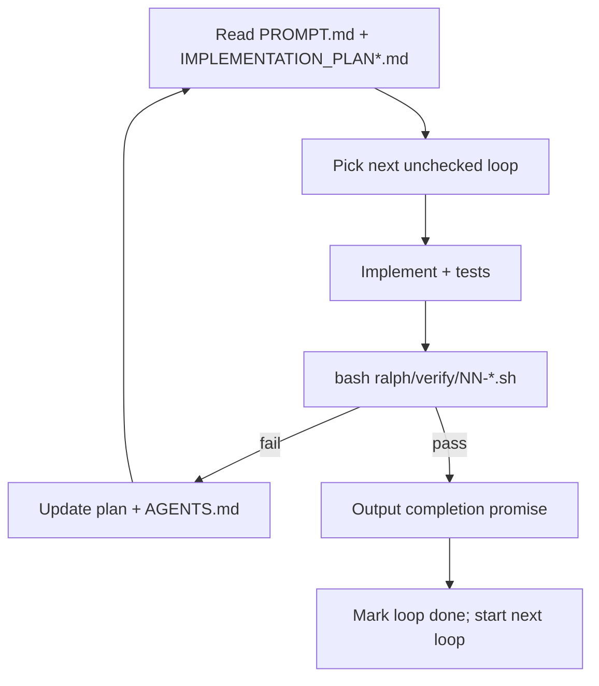

# Ralph loops — SonosStreamDeck

Each loop is a **fixed prompt**, **verify gate**, and **completion promise**. An agent iterates until verify passes or `--max-iterations` is hit. State lives on disk (`ralph/IMPLEMENTATION_PLAN*.md`, code, tests) — not in chat history.

## Phase 1 — Stub milestone (complete)

| Loop | Scope | Verify | Promise |
|------|-------|--------|---------|
| 01 | SSE / live state | `verify/01-sse-live-state.sh` | `SSE_LIVE_STATE_COMPLETE` |
| 02 | Action coverage | `verify/02-action-coverage.sh` | `ACTION_COVERAGE_COMPLETE` |
| 03 | PI dead-code cleanup | `verify/03-pi-dead-code.sh` | `PI_DEAD_CODE_COMPLETE` |
| 04 | PI polish | `verify/04-pi-polish.sh` | `PI_POLISH_COMPLETE` |
| 05 | Capability-aware UI | `verify/05-capability-ui.sh` | `CAPABILITY_UI_COMPLETE` |
| 06 | Album art | `verify/06-album-art.sh` | `ALBUM_ART_COMPLETE` |
| 07 | Stub milestone E2E | `verify/07-stub-milestone-e2e.sh` | `STUB_MILESTONE_COMPLETE` |

Plan: [IMPLEMENTATION_PLAN.md](./IMPLEMENTATION_PLAN.md) · Run all: `bash ralph/verify/run-all.sh`

## Phase 2 — Production Sonos (in progress)

Replace stub-backed broker behavior with a real Sonos Control API broker. **Plugin contract unchanged** (`docs/sonos-service-contract.md`).

| Loop | Scope | Verify | Promise |
|------|-------|--------|---------|
| 08 | Production broker scaffold | `verify/08-production-broker-scaffold.sh` | `PRODUCTION_BROKER_SCAFFOLD_COMPLETE` |
| 09 | Sonos OAuth + sessions | `verify/09-sonos-oauth.sh` | `SONOS_OAUTH_COMPLETE` |
| 10 | Groups + state bootstrap | `verify/10-sonos-discovery-state.sh` | `SONOS_DISCOVERY_STATE_COMPLETE` |
| 11 | Command writes | `verify/11-sonos-commands.sh` | `SONOS_COMMANDS_COMPLETE` |
| 12 | Subscriptions → SSE | `verify/12-sonos-subscriptions-sse.sh` | `SONOS_SUBSCRIPTIONS_SSE_COMPLETE` |
| 13 | Stub dev-only | `verify/13-stub-dev-only.sh` | `STUB_DEV_ONLY_COMPLETE` |
| 14 | Production milestone E2E | `verify/14-production-milestone-e2e.sh` | `PRODUCTION_MILESTONE_COMPLETE` |

Plan: [IMPLEMENTATION_PLAN-production.md](./IMPLEMENTATION_PLAN-production.md) · Run all: `bash ralph/verify/run-all-production.sh`

**Ports:** stub `47831` (CI / offline dev) · production broker `47832` (default in verify scripts)

**Live Sonos integration tests:** set `SONOS_CLIENT_ID`, `SONOS_CLIENT_SECRET`, `SONOS_REDIRECT_URI`; optional `SONOS_INTEGRATION_TEST=1` for loops 10–12 helpers.

## Cursor invocation (Loop 08 example)

```
Implement SonosStreamDeck Ralph Loop 08 per ralph/loops/08-production-broker-scaffold/PROMPT.md.
Run bash ralph/verify/08-production-broker-scaffold.sh until it passes.
Max 20 iterations. Update ralph/IMPLEMENTATION_PLAN-production.md and ralph/AGENTS.md as you go.
Output <promise>PRODUCTION_BROKER_SCAFFOLD_COMPLETE</promise> when verify exits 0.
```

## Lifecycle



## Prerequisites

- `npm install`
- **Stub:** `http://127.0.0.1:47831` via `npm run broker:stub`
- **Production:** `services/sonos-broker/` (Loop 08+) on `47832`; Sonos developer credentials for live tests
