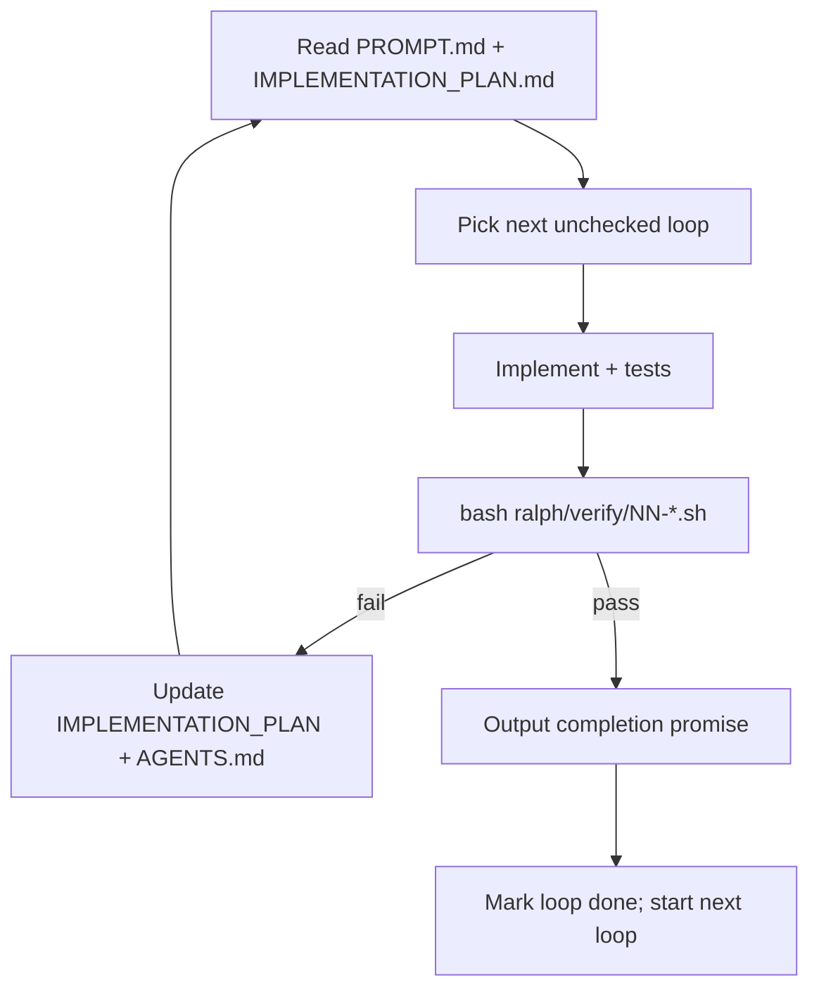

# Ralph loops — SonosStreamDeck stub milestone

Each loop is a **fixed prompt**, **verify gate**, and **completion promise**. An agent iterates until verify passes or `--max-iterations` is hit. State lives on disk (`ralph/IMPLEMENTATION_PLAN.md`, code, tests) — not in chat history.

## Run order

| Loop | Scope | Verify | Promise |
|------|-------|--------|---------|
| 01 | SSE / live state | `verify/01-sse-live-state.sh` | `SSE_LIVE_STATE_COMPLETE` |
| 02 | Action coverage | `verify/02-action-coverage.sh` | `ACTION_COVERAGE_COMPLETE` |
| 03 | PI dead-code cleanup | `verify/03-pi-dead-code.sh` | `PI_DEAD_CODE_COMPLETE` |
| 04 | PI polish | `verify/04-pi-polish.sh` | `PI_POLISH_COMPLETE` |
| 05 | Capability-aware UI | `verify/05-capability-ui.sh` | `CAPABILITY_UI_COMPLETE` |
| 06 | Album art | `verify/06-album-art.sh` | `ALBUM_ART_COMPLETE` |
| 07 | Stub milestone E2E | `verify/07-stub-milestone-e2e.sh` | `STUB_MILESTONE_COMPLETE` |

## Cursor invocation (per loop)

```
Implement SonosStreamDeck Ralph Loop 01 per ralph/loops/01-sse-live-state/PROMPT.md.
Run bash ralph/verify/01-sse-live-state.sh until it passes.
Max 20 iterations. Update ralph/IMPLEMENTATION_PLAN.md and ralph/AGENTS.md as you go.
Output <promise>SSE_LIVE_STATE_COMPLETE</promise> when verify exits 0.
```

Or use the official Ralph loop skill:

```
/ralph-loop "Implement Loop 01 per ralph/loops/01-sse-live-state/PROMPT.md. Run bash ralph/verify/01-sse-live-state.sh until pass. Update ralph/IMPLEMENTATION_PLAN.md." --max-iterations 20 --completion-promise "SSE_LIVE_STATE_COMPLETE"
```

## Lifecycle



## Prerequisites

- `npm install`
- Broker stub reachable at `http://127.0.0.1:47831` (verify scripts start it if needed via `npm run broker:start`)
